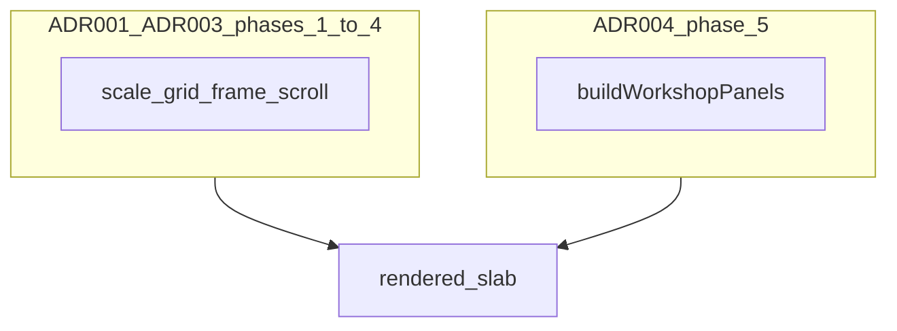
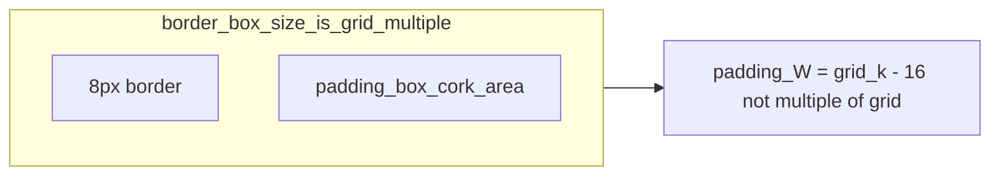
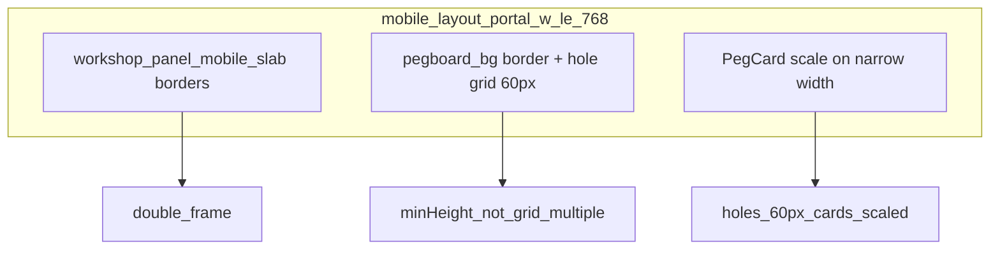
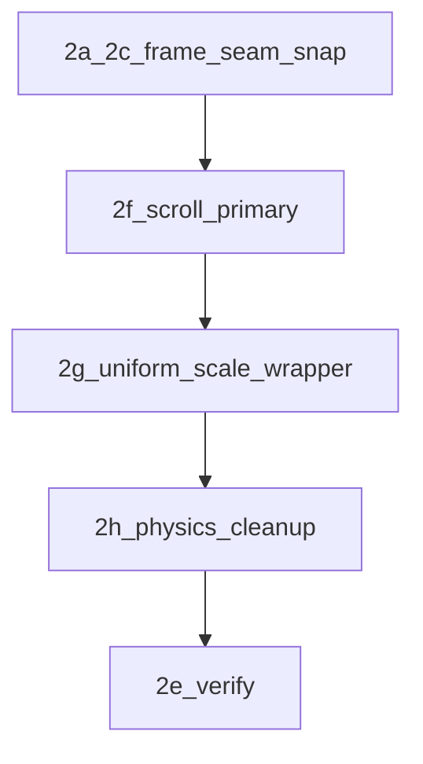

# Workshop pegboard (responsive + frame)

**Canonical plan file (repo):** [`.cursor/plans/responsive_pegcards_sizing_085cd05b.plan.md`](responsive_pegcards_sizing_085cd05b.plan.md) — edit this copy; keep in sync with any duplicate under `~/.cursor/plans/` if you still use Cursor’s plan UI there.

## Planning discipline (task breakdown)

This roadmap follows [`planning-and-task-breakdown`](../skills/planning-and-task-breakdown/SKILL.md): **dependency order** (frame → interaction model → single presentation transform → physics cleanup → verify), **vertical slices** (each slice leaves the UI shippable), **checkpoints** after each phase, and **`npm run check` + named viewports**. **Merged:** the separate “pegboard scale rethink” narrative (design-resolution + uniform `scale` vs multi-`gridPx` reflow on mobile) now lives **only in this file** under **Phase 2 revision** below. Multi-step delivery within a phase follows [`incremental-implementation`](../skills/incremental-implementation/SKILL.md): implement → **`npm test` / `npm run check`** → verify → next slice. **Phase 7** (reading typography, ADR-009) is **on hold** after **7a–7c** — **7d–7e** deferred until **Phase 8** shell/container direction stabilizes so typography density and VR baselines are not thrown away by `RisoBoardShell` changes. **Phase 8** tracks **[ADR-010](../../docs/decisions/010-site-wide-immersive-pegboard-shell.md)** (site-wide shell); it shares `RisoBoardShell`, visuals, and VR suites with Phase 7.

## Execution order (single program)

1. **Phase 1 — Pegboard border vs grid (done):** `content-box` + desktop wrapper `+PEGBOARD_BORDER_OUTSET` + verify.
2. **Phase 2 — Mobile / portal ≤768:**  
   - **2a–2c (done):** slab chrome, seam width, cork height snap (see Phase 2 historical).  
   - **2f → 2g → 2h (done):** scroll-primary interaction, then **one** presentation strategy for cork+hardware (prefer **uniform wrapper scale** of a fixed 60px-grid board), then delete threshold/unify/`pickMobileGridLayout` complexity made redundant.  
   - **2e (done):** verify after 2f–2h (`npm run check`, manual 320/375/768).
   - **2i (done):** visual regression suite for alignment (Playwright + committed baselines; CI gate).
   - **2j (done):** ADR-001 mobile contract (`docs/decisions/001-workshop-mobile-pegboard-contract.md`) + README pointer + `MobileScalePresentation` @see.
3. **Phase 3 — Blueprint sheet mask (done):** **`blueprint-sheet-mask`** — CSS variables + `--blueprint-mask-image` with container-query variants (e.g. 260px / 220px); visual regression green (`docker compose run --rm playwright-fast`).
4. **Phase 4 — Frame chrome in initial viewport (done):** **ADR-003** + **ADR-001 §7**. **`fillViewportSlot`** / **`h-svh`** / **no `prose` on workshop `main`** + pegboard-root column flex. **4c:** Playwright **Workshop in viewport (ADR-003)** — scroll/snap chrome + first `.pegboard-bg` in view; viewport matrix in [`tests/visual/workshop-pegboard.spec.ts`](../../tests/visual/workshop-pegboard.spec.ts) (obsolete **portal-frame** baseline names removed).
5. **Phase 5 — Workshop panel packing (done):** **[ADR-004](../../docs/decisions/004-workshop-panel-packing.md)** — which CMS entries share a horizontal panel is decided in **`buildWorkshopPanels`** (not viewport CSS): max **3** items; **≤1 work** and **≤1 links** per panel; **demos** fill remaining slots; backfill sorts **work → links → demos**, then **newest first** within a kind; **non-progress** leaves a **partial panel** when the pool cannot add without breaking caps. **Verify:** `npm test` (Vitest), `npm run check`.
6. **Phase 6 — Site shell vertical budget (done):** **6a** — [`tests/visual/site-pages.spec.ts`](../../tests/visual/site-pages.spec.ts) + `npm run test:visual:site-pages:*:docker`. **6b** — shell tokens in [`tailwind.config.cjs`](../../tailwind.config.cjs) + [`RisoBoardShell.astro`](../../src/components/RisoBoardShell.astro) / [`RisoNav.tsx`](../../src/components/RisoNav.tsx) / [`Footer.astro`](../../src/components/Footer.astro). **6c** — `npm run check` + `test:visual:update:docker` + `test:visual:docker` per [`visual-regression-docker.mdc`](../rules/visual-regression-docker.mdc); baselines committed.
7. **Phase 7 — Reading typography ([ADR-009](../../docs/decisions/009-reading-typography-prose-and-theme.md)) — ON HOLD:** **7a–7c complete** (inventory, theme variant, core layout wiring). **7d–7e deferred** (responsive density + Docker verify) until **Phase 8** immersive shell and container contract stabilize — avoids redoing typography and `site-pages` VR when `RisoBoardShell` / reading columns may still move. **Does not** relax ADR-003 (**no `prose` on workshop `#main-content`**). See Phase 7 heading.
8. **Phase 8 — Site-wide immersive pegboard ([ADR-010](../../docs/decisions/010-site-wide-immersive-pegboard-shell.md)):** **Active track** ahead of Phase 7 resumption. Normative: persistent viewport-wide **peg stage**, **URL→durable scene**, **item-layer** route transitions, **reading measure** inside full width per ADR-009. **ADR-011** (**accepted**, [DOM contract](../../docs/decisions/011-immersive-shell-dom-contract.md)) amends **ADR-008** for **outer** shell width when **`immersivePegStage`** is true; inner `board` bounds for tape/grain unchanged. **Tasks 8.8–8.12** (layout simplification: two-layer scroll contract, content-box **`portalLayout`**, `.workshop-page-stack` vs strip padding vs site footer seam, shadow gutter tokens, stale doc grep) — see **Tasks 8.8–8.12** under the Phase 8 section. **Resume Phase 7d–7e after** a vertical slice of Phase 8 shell lands so prose density aligns to final containers. **Visual regression:** plan for a **broad baseline redo** (`site-pages`, `site-chrome`, `workshop-pegboard`) when the shell stabilizes — see Phase 8 **Order of operations** step 4 below and todo **`phase8-86-visual-regression-redo`**.

## Phase 4: Workshop frame chrome (initial viewport)

**Problem (historical):** Workshop chrome lived in a TV-style frame; users could need **document scroll** to reach controls. **Goal (current):** **Bounded viewport height** — pegboard / slabs scroll **inside** the shell (`fillViewportSlot` + **`h-svh`** flex chain); no reliance on removed **portal-frame** nav.

**Dependency / clarification:** This does **not** relax ADR-001 **scroll vs drag** (pan-y on the peg stack). It **adds** a **vertical budget**: outer layout must not let peg content height push required chrome below the fold. Normative: ADR-003; mobile lattice: ADR-001.

### Task 4.1: Record decision (ADR)

**Description:** Capture the invariant, alternatives, and relationship to ADR-001 so agents do not conflate **scroll-primary** (gesture arbitration **inside** the peg column) with **document scroll** hiding workshop chrome — today **bounded `h-svh` flex** + inner scroll (**ADR-003**), not removed bottom **slab arrows**.

**Acceptance criteria:**
- [x] ADR-003 exists and is linked from README Architecture decisions.
- [x] ADR-001 references ADR-003 (contract §7 + consequences).

**Verification:**
- [x] Read ADR-003 + ADR-001 §7 for consistency.

**Dependencies:** None

**Files:**
- `docs/decisions/003-workshop-frame-chrome-initial-viewport.md`
- `docs/decisions/001-workshop-mobile-pegboard-contract.md`
- `README.md`

**Estimated scope:** Small

### Task 4.2: Implement bounded scroll region + frame fit

**Description:** Adjust workshop layout (React structure and/or `workshop-pegboard.css` and related workshop shell styles) so the **pegboard column** fits the **bounded viewport height** (`fillViewportSlot` / **`h-svh`** flex chain per **ADR-003**): scroll **inside** `.workshop-scroll--*` / mobile slab column, not the document. **Removed** TV-style **wood `portal-frame` / bottom slab arrows** — multi-panel navigation is **horizontal scroll / swipe** only. Reconcile with **mobile cork height** rules (ADR-001 §4) so the **scaled cork region** fits the slot **below site nav** and **above site `Footer`**.

**Acceptance criteria:**
- [x] At **320, 375, 430, 768, 1024, 1280** (workshop layout width where relevant), the **peg scroll region** and first **`.pegboard-bg`** are usable **without** scrolling the **document** on first load of the workshop visual fixture or real workshop route — **enforced by** `fillViewportSlot` / `fillViewportChain` + **`min-height: 0`** on the peg column / scroll strips (**ADR-003**); **confirm manually** (4c).
- [x] When peg content exceeds the middle region, **only** the designated inner region scrolls; frame does not move off-screen.
- [ ] ADR-001 scroll-primary behavior on the peg strip still holds (manual swipe test — 4c).

**Verification:**
- [x] `npm run check` clean.
- [x] `npm run test:visual` after baseline update (430/768 slab PNGs refreshed where mobile height changed).

**Dependencies:** Task 4.1

**Files touched:**
- `src/components/RisoBoardShell.astro` — `fillViewportChain`, `min-h-dvh` outer flex.
- `src/layouts/Main.astro` — `fillViewportSlot`, `workshop-viewport-slot` on `main`.
- `src/pages/workshop/[...page].astro`, `src/pages/workshop/visual-test.astro` — `fillViewportSlot`.
- `src/styles/workshop-pegboard.css` — `#main-content.workshop-viewport-slot .workshop-page-stack`.

**Estimated scope:** Medium

### Task 4.3: Regression signal (optional follow-up)

**Description:** Playwright encodes ADR-003: **`toBeInViewport`** on the **desktop horizontal scroll strip** (or mobile scroll owner) and first **`.pegboard-bg`** at standard widths; **locator** pegboard / scroll chrome screenshots; full-viewport **`workshop-page-with-chrome`** where site shell matters; **short viewport** `375×500` smoke. (**Obsolete:** `.workshop-panel-nav` / `.portal-frame` baselines — wood frame removed.)

**Status:** **Done** (2026-04-16) — see `tests/visual/workshop-pegboard.spec.ts` describes **Workshop peg viewport (ADR-003)** and **Workshop page with site chrome**.

**Acceptance criteria:**
- [x] CI encodes peg scroll strip + pegboard in viewport at key widths (+ chrome suite where applicable); no reliance on removed **portal-frame** pixels.

**Verification:**
- [x] `npm run test:visual` passes.

**Dependencies:** Task 4.2 + manual confirmation

**Estimated scope:** Small–Medium

### Checkpoint: After Phase 4

- [ ] **No document scroll** on workshop load at **320, 375, 430, 768, 1024, 1280** — peg column uses inner scroll (horizontal panels / vertical slabs); site nav remains in normal flow (**not** “scroll to find removed bottom arrows”).
- [ ] Inner peg region scrolls when needed; pan-y / drag behavior still matches ADR-001.
- [ ] `npm run check` clean.

## Phase 5: Workshop panel packing (ADR-004)

**Problem:** Without explicit rules, date-only backfill can stack **multiple work or multiple link cards** on one panel, which fights the LCD “one shelf” mental model and makes horizontal density worse.

**Separation of concerns:** [ADR-001](../../docs/decisions/001-workshop-mobile-pegboard-contract.md) / [ADR-003](../../docs/decisions/003-workshop-frame-chrome-initial-viewport.md) govern **how** pegboards render (scale, grid, frame, scroll). **[ADR-004](../../docs/decisions/004-workshop-panel-packing.md)** governs **what** entries are grouped into each panel.



### Task 5.1: Record and cross-link (ADR)

**Description:** ADR-004 is the normative contract; README Architecture decisions and this plan reference it so packing is not “re solved” in CSS-only tasks.

**Acceptance criteria:**

- [x] [ADR-004](../../docs/decisions/004-workshop-panel-packing.md) exists; README lists it.
- [x] Canonical plan execution order includes Phase 5; spec **item 8** and **Checkpoint A4** below align with ADR-004 (no “date-only backfill” as sole rule).

**Verification:**

- [x] Read ADR-004 + `buildWorkshopPanels` JSDoc `@see` together.

**Dependencies:** None

**Files:**

- [`docs/decisions/004-workshop-panel-packing.md`](../../docs/decisions/004-workshop-panel-packing.md)
- This plan file

**Estimated scope:** Small

### Task 5.2: Implementation matches ADR (code)

**Description:** Single source of truth: [`src/utils/buildWorkshopPanels.ts`](../../src/utils/buildWorkshopPanels.ts) implements ADR-004 Decision items (panel size, per-kind caps, primary placement order, pool sort, stop when nothing fits).

**Acceptance criteria:**

- [x] At most three items per panel; at most one `work` and one `links`; demos may fill remaining slots.
- [x] Backfill uses kind priority **work → links → demos**, then **newest first** within kind (`modDatetime` ?? `pubDatetime`).

**Verification:**

- [x] `npm run check`

**Dependencies:** Task 5.1 (conceptual)

**Files:**

- [`src/utils/buildWorkshopPanels.ts`](../../src/utils/buildWorkshopPanels.ts)

**Estimated scope:** Small

### Task 5.3: Unit tests as regression lock

**Description:** Vitest locks caps, pool ordering, and **non-progress** partial panels per ADR-004 Consequences.

**Acceptance criteria:**

- [x] `npm test` runs `src/utils/buildWorkshopPanels.test.ts` green.

**Verification:**

- [x] `npm test`

**Dependencies:** Task 5.2

**Files:**

- [`src/utils/buildWorkshopPanels.test.ts`](../../src/utils/buildWorkshopPanels.test.ts)

**Estimated scope:** Small

### Checkpoint: After Phase 5

- [x] Plan + ADR-004 agree on packing rules (no stale “3 items only” without per-kind caps).
- [x] `npm test` and `npm run check` clean after changes.
- [x] Packing remains **data-layer**; viewport/CSS phases do not redefine panel membership.

## Phase 3: Blueprint sheet mask (task breakdown)

This phase follows the task breakdown format from `planning-and-task-breakdown`: small tasks with explicit acceptance criteria and verification, plus a checkpoint.

## Task 3.1: Define mask tuning knobs (CSS-only)

**Description:** Decide which blueprint mask aspects are tunable (hole radius, grid line weight, paper opacity) and how they are selected (container queries vs a small set of variants).

**Acceptance criteria:**
- [x] Mask tuning variables are explicitly listed (names + allowed ranges or discrete variants).
- [x] Selection mechanism is documented (container queries preferred).

**Verification:**
- [x] Manual: compare at least two representative card sizes and confirm the mask remains readable.

**Dependencies:** None

**Files likely touched:**
- `src/styles/workshop-pegboard.css`

**Estimated scope:** Small

## Task 3.2: Implement mask variant selection

**Description:** Implement the chosen tuning mechanism (e.g. 2–3 discrete mask variants) and wire it to container width.

**Acceptance criteria:**
- [x] Small cards do not lose hole readability.
- [x] Large cards retain the intended “paper cutout” look.

**Verification:**
- [x] Visual regression passes: `npm run test:visual` (review diffs if any).
- [x] Manual: spot-check the blueprint cards at a narrow and wide width.

**Dependencies:** Task 3.1

**Files likely touched:**
- `src/styles/workshop-pegboard.css`
- (optional) move the mask SVG out of a data URL if editing becomes painful

**Estimated scope:** Medium

### Checkpoint: After Phase 3

- [x] Visual regression suite passes (`npm run test:visual`).
- [x] Manual: blueprint cards read well at both narrow and wide widths.

**Checkpoint after Phase 2:** No double slab frame; seam rhythm; screws on grid; **no drag affordance conflict** with vertical scroll; **one pixel ruler** for holes + cards on mobile (wrapper scale or equivalent); `npm run check` clean.

**Checkpoint after Phase 3:** Mask/hole weight readable at small card widths; `npm run check` clean — verified 2026-04-16 (`npm run check` + `docker compose run --rm playwright-fast`, 8/8).

### Note: “Some items feel too big”

If certain hardware cards feel visually too large for the board at some widths, that’s a **content density** / **component sizing** problem (not an alignment invariant). We intentionally deferred it until after alignment is stable. Likely levers (later phases):

- Reduce hardware **grid units** (e.g. LCD 7×5 → smaller) or introduce “compact units” at certain container widths.
- Add container-query-driven **density modes** inside cards (padding/gaps/typography) so perceived size shrinks without breaking the peg ruler.
- Phase 3 blueprint mask tuning can also adjust perceived weight, but true “too big” usually means units/density, not mask.

## Phase 2i: Visual regression tests (pegboard alignment)

The pegboard has multiple alignment invariants (hole pitch, screw inset, border/content-box semantics, scale wrapper). These are easy to break with “small” CSS/JS changes, so we add screenshot tests that lock the visuals down.

**Status:** Shipped. See `tests/visual/workshop-pegboard.spec.ts` and `/workshop/visual-test`. Baselines are committed; CI enforces this on PRs.

### Ongoing maintenance (add new cases when behavior changes)

When making changes that affect visuals (layout, scale math, blueprint mask variants, portal chrome), treat the screenshot suite as part of the deliverable:

- **Add/adjust screenshots** for the affected state(s) (new breakpoint, new mask variant, new alignment invariant).
- Prefer **locator screenshots** (e.g. `.pegboard-bg`) for stability; use cropped full-page shots only when portal chrome/seams are the invariant.
- **Verification:** `npm run test:visual` (and update baselines intentionally via `npm run test:visual:update` when changes are desired).

### Unknowns to suss out first (so tests don’t flake)

- **Deterministic fixture strategy:** do we prefer a dedicated route (`/workshop/visual-test`) or a query flag (e.g. `?visualTest=1`) on the existing workshop route? (Goal: stable content + stable number of slabs.)
- **What to assert:** full-portal screenshot vs `locator(".pegboard-bg")` / per-panel slab screenshot. (Goal: maximum signal with minimum churn.)
- **Font stability:** do we need to wait for `document.fonts.ready` and/or preload fonts in the fixture? (Goal: avoid sub-pixel layout drift between CI runs.)
- **Animation stability:** ensure `prefers-reduced-motion` is set and any Framer / CSS animations are either disabled or fully settled before screenshot.

### Tooling choice

- Use **Playwright** (`@playwright/test`) for deterministic screenshots in CI.
- Baselines are **committed** to git; PRs fail when diffs exceed threshold.

### What to screenshot (minimal, high-signal)

- Workshop page at widths that historically exposed alignment drift:
  - **mobile:** 320, 375, 430
  - **tablet:** 768
  - **desktop:** 1024, 1280
- One screenshot per slab (or one full-portal screenshot if stable), with `prefers-reduced-motion` on and animations disabled.

### Exact screenshot set (recommended)

Prefer **locator screenshots** for stability (less churn from portal chrome) plus **one** targeted slab+seam shot to protect the frame/seam work.

#### Locator screenshots (core alignment invariants)

At each width below, take **three** screenshots by slab index (must have 3 slabs in fixture):

- `pegboard-bg--slab1--w320`
- `pegboard-bg--slab2--w320`
- `pegboard-bg--slab3--w320`

Repeat for: **375, 430, 768, 1024, 1280**.

Implementation detail: in the fixture, give each slab a stable attribute (e.g. `data-testid="workshop-slab"`), then:

- select slab by index
- inside that slab, snapshot `locator(".pegboard-bg")`

This is the direct guardrail for “panel 1 vs panel 2/3 scale drift.”

#### Slab+seam screenshots (frame rhythm)

Only at **375** and **768**:

- `slab-seam-and-frame--w375`
- `slab-seam-and-frame--w768`

Scope these to a tight crop that includes:

- the seam element
- the right edge of slab 1 and left edge of slab 2 (so double-frame and seam-width issues show up)

### How to avoid flakiness

- Add a deterministic “test fixture” for workshop panels (no content-driven randomness):
  - Either a dedicated route like `/workshop/visual-test` or a query flag (e.g. `?visualTest=1`) that renders a fixed set of panels and hides time-dependent UI.
- Disable fonts jitter where possible (load local fonts, or wait for `document.fonts.ready` before snapping).

### Acceptance criteria

- Running locally produces stable screenshots across runs.
- CI on PR compares against committed baselines.
- A change that breaks right-screw alignment / hole pitch produces a clear diff at at least one of the target widths.

### Regression matrix (recap of issues from this thread → tests)

This is the “nothing missed” checklist of what broke during Phase 2 work and how we prevent it from returning.

#### A. Frame + seams (CSS-only regressions)

- **A1: No double-frame on mobile slabs** (Phase 2a)
  - **Protects:** slab wood border stacking on top of `.pegboard-bg` border.
  - **Test:** visual snapshot at 375 + 768 of the full slab region; confirm a single frame.
- **A2: Seam width matches slab width** (Phase 2b)
  - **Protects:** seam reading wider than panels (visual jitter between slabs).
  - **Test:** snapshot including seam + adjacent slabs at 375 + 768.

#### B. Grid math (content-box / hole tiling / screw inset)

- **B1: Right screws align with holes on desktop** (Phase 1 + later fixes)
  - **Protects:** hole tiling origin drifting from screw inset (e.g. missing `background-origin: content-box`).
  - **Test:** `locator(".pegboard-bg")` screenshot at 1024 + 1280; review TR/BR vs hole centers.
- **B2: Mobile cork height snapped to grid** (Phase 2c)
  - **Protects:** bottom screws drifting due to non-grid-multiple height (was `minHeight: 8rem`).
  - **Test:** `locator(".pegboard-bg")` screenshot at 768 (and 375 if content tall enough).

#### C. “One pixel ruler” across hardware + holes + screws (mobile)

- **C1: No per-card scaling against a different hole pitch** (mobile bug theme)
  - **Protects:** cards shrink while dots remain at 60px (hardware no longer on-grid).
  - **Test:** mobile 375 + 768 `.pegboard-bg` snapshots; verify card edges and hole rhythm stay coherent.
- **C2: Panel-to-panel consistency (first vs second/third drift)** (mobile bug theme)
  - **Protects:** scale/grid computed from per-panel items.
  - **Test:** fixture must include 3 slabs; take one `.pegboard-bg` snapshot per slab at 375 + 768 and compare. (Or a single snapshot of the whole mobile column if stable.)

#### D. Transform + clipping (the 320px class of regressions)

- **D1: No right-edge clipping at 320** (reported)
  - **Protects:** scale-slot sized to the wrong width (or overflow clipping the transformed surface).
  - **Test:** 320px `.pegboard-bg` snapshot + full slab snapshot; ensure TR/BR screws visible.

#### E. Interaction model (scroll vs drag)

- **E1: Scroll-primary mobile never feels “stuck”** (Phase 2f)
  - **Protects:** touch gesture capture by cards / `stopPropagation` preventing scroll.
  - **Test:** Playwright “smoke interaction” (optional) or manual: one-finger vertical scroll at 320/375/768; confirm taps on links still work.
- **E2: Desktop drag still works and links don’t accidentally drag** (desktop baseline)
  - **Protects:** regressing `stopDragChain` gating for draggable cards.
  - **Test:** manual at 1024+: drag a card; click a link; ensure behavior is correct.

#### F. Compile-time safety (caught early in this thread)

- **F1: Typecheck catches stale imports / missing symbols**
  - **Protects:** `hardwareDims` import regression that broke `tsc`.
  - **Test:** CI must run `npx tsc --noEmit` (or `npm run check` if it includes TS) on every PR.

### Task breakdown (per planning skill)

## Task 2i.1: Add Playwright + first smoke screenshot

**Description:** Add Playwright test runner and one screenshot test that visits a deterministic workshop fixture at a single width (start with 768) and snapshots the pegboard surface.

**Acceptance criteria:**
- [ ] `npx playwright test` runs locally.
- [ ] A screenshot baseline is generated and committed.
- [ ] Re-running the test without changes produces no diff.

**Verification:**
- [ ] Tests pass: `npx playwright test`
- [ ] Manual check: open the saved baseline and confirm screws/holes visible.

**Dependencies:** None

**Files likely touched:**
- `package.json` (devDependency + scripts)
- `playwright.config.*`
- `tests/visual/workshop-pegboard.spec.*`

**Estimated scope:** Medium

## Task 2i.2: Add deterministic workshop fixture (route or flag)

**Description:** Ensure screenshots use stable content: fixed set of 2–3 slabs with known hardware mix (include an LCD width case), no time/randomness, stable scroll position.

**Acceptance criteria:**
- [ ] Fixture renders the same DOM structure across runs.
- [ ] Fixture does not depend on CMS/content ordering.
- [ ] At least 3 slabs exist so “first vs second/third” regressions are catchable.

**Verification:**
- [ ] Manual: visit fixture in browser and verify consistent slabs/cards.

**Dependencies:** Task 2i.1 (or can be parallel if preferred)

**Files likely touched:**
- `src/pages/workshop/[...page].astro` (if query-flag) or new route under `src/pages/workshop/`
- `src/components/workshop/WorkshopPegboard.tsx` (optional fixture-only props)

**Estimated scope:** Medium

## Task 2i.3: Expand screenshot matrix (the “alignment invariants” set)

**Description:** Add the full viewport set (320/375/430/768/1024/1280), and decide whether to snapshot the full portal or only `.pegboard-bg` (prefer locator snapshots for lower churn).

**Acceptance criteria:**
- [ ] Each target width produces a stable screenshot.
- [ ] A deliberate break to (a) background-origin/clip, (b) mobile scale math, or (c) border outset causes an obvious diff at some width.

**Verification:**
- [ ] `npx playwright test` passes locally twice in a row.
- [ ] Manual: inspect at least one diff image by intentionally tweaking a known invariant.

**Dependencies:** Tasks 2i.1–2i.2

**Files likely touched:**
- `tests/visual/workshop-pegboard.spec.*`

**Estimated scope:** Small

## Task 2i.4: Wire into CI (PR gate)

**Description:** Run visual tests in CI on PRs; store artifact outputs on failure; keep baseline updates explicit.

**Acceptance criteria:**
- [ ] CI runs Playwright tests on PR.
- [ ] On failure, artifacts include expected/actual/diff images.

**Verification:**
- [ ] Open a PR that intentionally changes a screenshot and confirm CI fails with artifact links.

**Dependencies:** Tasks 2i.1–2i.3

**Files likely touched:**
- CI config (repo-specific; e.g. `.github/workflows/*`)

**Estimated scope:** Medium

## Phase 1: Pegboard border vs grid (implemented)

### Root cause (historical)

[`src/styles/workshop-pegboard.css`](../../src/styles/workshop-pegboard.css) used **`box-sizing: border-box`** with **`border: 8px`** while [`src/components/workshop/PegboardPanels.tsx`](../../src/components/workshop/PegboardPanels.tsx) set **`width` / `height` to `innerWFinal` / `innerH`** (multiples of the active `grid`). The **padding box** was therefore **`inner − 16`**, which is **not** a multiple of `grid` (since 16 is not divisible by 42/48/54/60). Hole tiling uses the padding box; **TL** aligned, **TR / BL / BR** did not.



### Fix shipped

- **`box-sizing: content-box`** on `.pegboard-bg`: cork `width`/`height` are grid-snapped **content** sizes; border sits outside.
- Desktop wrapper in `PegboardPanelDesktop`: **`innerWFinal + PEGBOARD_BORDER_OUTSET`** × **`innerH + PEGBOARD_BORDER_OUTSET`** so `overflow: hidden` does not clip the frame (`PEGBOARD_BORDER_OUTSET = 16`).
- Comment on `.pegboard-bg` documents cork vs border semantics.
- Connector bands: still driven by `getBoundingClientRect()` on `.pegboard-bg` in [`WorkshopPegboard.tsx`](../../src/components/workshop/WorkshopPegboard.tsx).

### Ideal task order for this slice (skill: foundation → dependent → verify)

1. **`css-content-box`** — must land **with** **`wrapper-dimensions`** in one deliverable (task 1 alone briefly clips).
2. **`verify-connectors-mobile`** — manual + `npm run check`.

### Alternative (not used)

Inner **`.pegboard-cork`** without border + outer **`.pegboard-frame`** with border — same geometry, more DOM.

## Phase 2: Mobile / portal ≤768 (pending)

Layout mode: [`WorkshopPegboard.tsx`](../../src/components/workshop/WorkshopPegboard.tsx) sets `isMobile: width <= 768` on portal-inner width. **1024px** uses desktop pegboard (Phase 1 + scaled `gridPx`); **768px and narrow** use the mobile stack path below.

### What is going wrong (mapped to your report)

| Symptom | Likely cause in code |
|--------|----------------------|
| Extra border + padding around the real pegboard frame | [`.workshop-panel--mobile-slab`](../../src/styles/workshop-pegboard.css) adds **8px wood borders** on left/right (and top/bottom on first/last) **in addition to** [`.pegboard-bg`](../../src/styles/workshop-pegboard.css)’s own **8px** frame border — two frames. [`.workshop-panel--mobile`](../../src/styles/workshop-pegboard.css) also has **`padding: 0 1rem`**, which reads as “padding outside the pegboard border.” |
| Hardware not aligned with pegholes at 768 / small; OK at 1024 desktop | At `width <= 768`, **mobile** layout. [`PegCard.tsx`](../../src/components/workshop/PegCard.tsx) applies **`scale()`** when `dragDisabled && availableWidth < w + 32` (mobile stack path). Cards shrink; **`.pegboard-bg` radial grid stays `--peg-grid-px: 60px`** — pattern and hardware no longer share one pixel ruler. Desktop at 1024 uses [`PegboardPanelDesktop`](../../src/components/workshop/PegboardPanels.tsx) + `gridPx` + `hardwareDimsWithGrid` — consistent. |
| Bottom + top-right screws off on mobile | Phase 1 `content-box` fixed **width** vs border on desktop when width is a grid multiple. Mobile pegboard uses **`minHeight: '8rem'`** ([`PegboardPanels.tsx`](../../src/components/workshop/PegboardPanels.tsx) mobile) so **height is not snapped** to the peg grid; BR/BL use `bottom: calc(var(--peg-grid-px)/2)` on a cork whose content height is not a multiple of the peg step → same class of bug as the old border-box width issue, on the **vertical** axis. |
| First pegboard looks wider than the rest | [`.slab-seam`](../../src/styles/workshop-pegboard.css) is **`width: 100%`** with `max-width: 420px`, while [`.workshop-panel--mobile`](../../src/styles/workshop-pegboard.css) is **`width: 92%`** — the seam strip can read as a **wider** band between slabs than each pegboard column. Slab borders also add **16px** outer width vs the pegboard alone. |



### Recommended approach (maps to YAML `mobile-pegb-*`)

1. **Remove duplicate “slab” frame (CSS)** — `mobile-pegb-remove-slab-double-border`  
   In [`src/styles/workshop-pegboard.css`](../../src/styles/workshop-pegboard.css), **remove or neutralize** wood **`border-*` on `.workshop-panel--mobile-slab`** (and `--first` / `--last` top/bottom). Keep separation with **gap**, **seam** line, and/or **box-shadow** on `.pegboard-bg` only. Revisit **`.workshop-panel--mobile` `padding: 0 1rem`**.  
   **Acceptance:** One clear frame around the cork.

2. **Align `.slab-seam` width** — `mobile-pegb-align-slab-seam`  
   Match seam to panel: **`width: 92%`**, **`max-width: 420px`**, **`margin-left/right: auto`**.  
   **Acceptance:** Slabs and seam share horizontal rhythm.

3. **Snap mobile cork height to peg grid** — `mobile-pegb-snap-cork-height`  
   In [`PegboardPanelMobile`](../../src/components/workshop/PegboardPanels.tsx): `useLayoutEffect` + `ResizeObserver` or derived sum; set cork **content height** to **`Math.ceil(h / PEG_GRID) * PEG_GRID`**.  
   **Acceptance:** BL/BR screws on bottom row of holes at 768px.

4. **Hardware vs pegholes (evolved)** — superseded by **Phase 2 revision** (`mobile-uniform-presentation`). Historical options for context:

- **Former Option A:** match `gridPx` + `hardwareDimsWithGrid` on mobile (implemented in code as an intermediate step).
- **Former Option B:** solid cork while cards scale.
- **Current direction:** **scroll-primary mobile (2f)** + **single uniform wrapper scale of a fixed 60px design board (2g)** so dots/screws/cards never disagree; then **cleanup (2h)**. Per-card `scale()` against a different hole pitch is explicitly what we are exiting.

5. **Verification** — `mobile-pegb-verify`  
   Manual **768px**, **320 / 375**; **`npm run check`**.

### Files to touch (Phase 2)

- [`src/styles/workshop-pegboard.css`](../../src/styles/workshop-pegboard.css)
- [`src/components/workshop/PegboardPanels.tsx`](../../src/components/workshop/PegboardPanels.tsx)
- [`src/components/workshop/PegCard.tsx`](../../src/components/workshop/PegCard.tsx)
- Optionally [`src/utils/workshopPegboardPhysics.ts`](../../src/utils/workshopPegboardPhysics.ts) / [`src/components/workshop/pegboardDimensions.ts`](../../src/components/workshop/pegboardDimensions.ts) for shared grid-pick helper.

### Out of scope (unless you want it)

- Changing the **768** breakpoint (`WorkshopPegboard` `isMobile` threshold) — product decision.

## Phase 2 revision — merged “scale rethink” + scroll-primary mobile

**Intent (planning skill: dependency order):** settle **interaction** before **presentation math**. If users do not need to **touch-drag** peg cards while the workshop is in **vertical scroll** mode (`data-pegboard-layout="mobile"`), we can treat mobile hardware as **presentational** (read-only stack), which pairs naturally with **one uniform `transform: scale(s)`** around cork + cards instead of chasing alignment via multiple `--peg-grid-px` candidates, per-card `scale()`, unify/narrow portal thresholds, etc.

### 2f — Scroll-primary interaction (`mobile-interaction-scroll-primary`)

**Product rule:** On portal widths that use the **mobile column** (vertical `.workshop-scroll--mobile`), **do not support** Framer drag / peg repositioning. Scrolling the slab column is the primary gesture; cards remain static content (today they already receive `dragDisabled`; formalize and harden).

**Engineering tasks (vertical slice):**

- **CSS:** Ensure vertical pan wins — e.g. `touch-action: pan-y` on the scroll container or card wrappers, and avoid `touch-none` on static mobile cards unless required for a different reason. Audit [`workshop-pegboard.css`](../../src/styles/workshop-pegboard.css) + [`PegCard.tsx`](../../src/components/workshop/PegCard.tsx) for anything that captures pointers.
- **React:** Remove or gate dead code paths (e.g. mobile stack branch still mounting `motion` drag machinery if unnecessary — only if it simplifies bundle/behavior after review).
- **Acceptance:** At 320–768px, one-finger vertical scroll never feels “stuck”; no accidental card drag; links/buttons **inside** cards remain tappable (`pointer-events` scoped, not `none` on whole card unless justified).

**Dependencies:** 2a–2c done (stable frame).

### 2g — Uniform presentation (`mobile-uniform-presentation`)

**Problem being retired:** Reflow via [`pickMobileGridLayout`](../../src/utils/workshopPegboardPhysics.ts) (60→42) changes hole pitch **and** card px independently per slab / threshold, which exploded edge cases (unify across slabs, narrow portal exception, grid-aligned stack vs centered stack).

**Preferred approach:** **Design-time board** at fixed **60px** grid (same logical units as desktop). **One** wrapper computes `s = min(1, availableContentWidth / designBoardWidth)` (and optionally height), applies `transform: scale(s)` to **both** `.pegboard-bg` and the stacked cards so **radial dots, screws, and hardware share one transform** — no separate “recalculate dot placement” per breakpoint.

**Tradeoffs (document in PR):** smaller physical tap targets when `s < 1`; subpixel blur (mitigate with rounded `s`, `translateZ(0)`, or min clamp). **No drag** on this path removes pointer-to-layout coordinate mapping work.

**Acceptance:** All mobile slabs same cork width/pattern without special-case unify; holes stay visually on-card without per-card `scaleFactor`.

**Dependencies:** 2f preferred first (interaction model clear), but can prototype wrapper earlier behind review.

### 2h — Physics / config cleanup (`mobile-physics-cleanup`)

Remove or shrink: unified `mobilePegLayout` plumbing, `[data-workshop-narrow-mobile]`, multi-candidate `pickMobileGridLayout` for scroll-mobile **if** 2g lands. **Keep** desktop horizontal-scroll packing, `gridPx` repack, and drag snap for **`isMobile === false`**.

**Dependencies:** 2g stable + checkpoint signed off.

### Task graph (mermaid)



### Supersedes

- YAML **`mobile-pegb-unify-grid-scale`** — cancelled; replaced by **2f–2h**.
- Standalone file `pegboard_scale_rethink_5944158c.plan.md` (historical Cursor plan) — **do not execute separately**; narrative merged here only.
- Standalone file `shell_spacing_token_unify_6e67f27c.plan.md` (Cursor `CreatePlan` artifact) — **superseded**; shell spacing methodology lives **only** under Phase 6 below (same canonical file as pegboard roadmap).

## Phase 6: Site shell vertical budget (global)

**Problem:** [ADR-003](../../docs/decisions/003-workshop-frame-chrome-initial-viewport.md) vertical budget is tight on workshop because **site chrome** (outer padding, nav `py-*`, column `gap-*`, footer) consumes `h-svh` before `portal-inner` is measured. Workshop-only CSS cannot reclaim height that is spent **above** `#main-content`.

**Goal:** Slightly smaller shell on **all** pages using `RisoBoardShell`, with workshop as the primary beneficiary. **Non-goals:** ADR-001 lattice, ADR-004 packing.

### Site chrome spacing discipline (agreement with design tokens)

**Why:** Numeric Tailwind alone (`p-4`, `gap-8`) sits on the same 4px rhythm as [`--spacing: 0.25rem`](../../src/styles/base.css) but is **not declared** as multiples of the project token; tightening then invites ad-hoc values. **Discipline:** treat `--spacing` as the base unit; express **board shell** layout as **integer multiples** of it, same spirit as [`.app-layout` `padding-inline: calc(var(--spacing) * 4)`](../../src/styles/base.css) and [`frontend-ui-engineering` spacing scale](../skills/frontend-ui-engineering/SKILL.md) (“don’t invent values”).

**Tailwind:** [`tailwind.config.cjs`](../../tailwind.config.cjs) already extends `spacing.spacing` → `var(--spacing)`. **Add** a small set of **semantic shell keys** (6–10), each `calc(var(--spacing) * N)` — e.g. `board-outer`, `board-column-gap`, `board-inner-x`, `nav-block-y`, `nav-link-gap`, `footer-block-y`, `footer-link-gap` — then use **only** those utilities in [`RisoBoardShell.astro`](../../src/components/RisoBoardShell.astro), [`RisoNav.tsx`](../../src/components/RisoNav.tsx), [`Footer.astro`](../../src/components/Footer.astro) for chrome `p-*` / `gap-*` / `py-*` / `pt-*`.

**Non-goals for shell chrome:** raw `px` or fractional `rem` for layout rhythm; repo-wide replacement of every `gap-*` outside the shell trio.

**Out of scope here:** workshop pegboard **inner** layout (ADR-001 / ADR-004) — still workshop CSS/components; this phase is **global board column** only.

**Nav one-offs:** purely decorative offsets (e.g. dust tooltip) may stay arbitrary with a one-line comment **or** re-express as `calc(var(--spacing)*N)` if an integer N reads cleanly.

**Vertical budget (Phase 6b after tokenize):** reduce **N** in token definitions or add `max-sm:` / `max-lg:` overrides — **not** new magic classes like `p-3.5`. Keep `fillViewportChain` / `h-svh` unchanged.

**Visuals:** Expect a **`test:visual:update:docker`** pass after **tokenization** (computed layout can shift slightly even before intentional tightening); review diffs, then run **`test:visual:docker`** green.

**ADR:** Optional one-line under ADR-003 **Consequences** — global shell vertical budget may be adjusted via **shared spacing tokens** (allowed lever; avoids per-page one-offs).

**Implementation (files):**

| Area | Files | Direction |
|------|-------|-------------|
| Shell wrapper | [`RisoBoardShell.astro`](../../src/components/RisoBoardShell.astro) | Map outer/inner `p-*`, column `gap-*` to shell tokens; responsive variants on the **same scale**; keep `fillViewportChain` / `h-svh` |
| Nav | [`RisoNav.tsx`](../../src/components/RisoNav.tsx) | `py-*` / `gap-*` from shell tokens; optional `max-sm:` so large viewports stay airy |
| Footer | [`Footer.astro`](../../src/components/Footer.astro) | `pt` / `gap` from shell tokens; manual tap-target check on `.dymo` links |
| Theme | [`tailwind.config.cjs`](../../tailwind.config.cjs) | Define semantic `calc(var(--spacing)*N)` spacing keys used above |

### Phase 6a — Playwright: non-workshop page visuals

**Gap today:** [`site-chrome.spec.ts`](../../tests/visual/site-chrome.spec.ts) snapshots nav/footer on **`/workshop/visual-test` only** — shell changes can break **posts / work / demos** without a diff.

**Add** [`tests/visual/site-pages.spec.ts`](../../tests/visual/site-pages.spec.ts) (new):

| Route | Path | Snapshot target |
|-------|------|-----------------|
| Posts index | `/posts` | Full **viewport** `page` screenshot (nav + board + fold); not full-page scroll |
| Blog post | `/posts/<slug>` | Same; pin slug to a committed [`src/content/blog`](../../src/content/blog) entry |
| Work | `/work/<slug>` | e.g. `design-pro` / `onboarding-app` under [`src/content/work`](../../src/content/work) |
| Demo | `/demos/<slug>` | e.g. `optimistic`, `drag-and-drop` under [`src/content/demos`](../../src/content/demos) |

**Harness:** Reuse [`viewportPresets.ts`](../../tests/visual/viewportPresets.ts); `networkidle` + `document.fonts.ready` + `reducedMotion` (same pattern as [`workshop-pegboard.spec.ts`](../../tests/visual/workshop-pegboard.spec.ts)).

**Viewport count:** Prefer full `VISUAL_TEST_WIDTHS` if stable; otherwise start with **375 + 768 + 1024** then expand.

**Baselines:** e.g. `posts-index--w768.png` under `tests/visual/__screenshots__/site-pages.spec.ts/`. **CI:** `astro dev` in Playwright config already resolves collections from repo.

### Phase 6b–6c — Implement shell + verify

- **6b —** Add shell spacing keys → wire the three components → tighten multiples for vertical budget (order matters). **Done.**
- **6c —** **`npm run check`**; **`npm run test:visual:update:docker`** then **`npm run test:visual:docker`** for `site-chrome`, `workshop-pegboard`, and **`site-pages`**. **Done** (Linux Docker baselines refreshed and green).

### Checkpoint: After Phase 6

- [x] Workshop: nav arrows + first pegboard still `toBeInViewport` at standard widths (ADR-003 tests in `workshop-pegboard.spec.ts`; Phase 6c Docker run green).
- [x] New `site-pages` suite green in Docker (`npm run test:visual:site-pages:docker` / full `test:visual:docker`).
- [ ] Manual: one homepage or index + one demo — chrome does not feel cramped or inaccessible.

## Phase 7: Reading typography (`@tailwindcss/typography`)

> **ON HOLD (2026-04-20):** **7a–7c** are done. **7d** (responsive reading density) and **7e** (Docker visual verification) are **deferred** until **[Phase 8](#phase-8-site-wide-immersive-pegboard-adr-010)** ([ADR-010](../../docs/decisions/010-site-wide-immersive-pegboard-shell.md)) shell and container work stabilizes — full-bleed peg stage and revised `RisoBoardShell` bounds would otherwise force **duplicate** typography tuning and **duplicate** `site-pages` baseline refreshes.

**Normative doc:** [ADR-009: Reading typography — `@tailwindcss/typography`, `prose` boundaries, and theme vs CSS](../../docs/decisions/009-reading-typography-prose-and-theme.md) — invariants (workshop vs reading), customization surface, verification; this phase’s tasks implement and refine that ADR.

**Problem:** Phase 6 addressed **shell spacing** only. Long-form typography was split across [`theme.extend.typography.DEFAULT`](../../tailwind.config.cjs), [`.entry-body`](../../src/styles/base.css) (`@apply prose …`, unused in markup), bespoke `.analog-prose` in [`riso.css`](../../src/styles/riso.css), and per-layout class stacks. **7.2** moves the reading column into [`tailwind.typography-analog.cjs`](../../tailwind.typography-analog.cjs) (`prose prose-analog`); **7.3–7.4** still need to align remaining layouts and delete stale narrative in this section.

**Goal:** Embrace **official Tailwind Typography practice**: customize reading experience primarily via **`tailwind.config.js` → `theme.extend.typography`** (named variants + shared `css` objects), consume it with **`prose` + `prose-{variant}`** and **element modifiers** (`prose-headings:…`, `prose-a:…`, `prose-img:…`, `prose-pre:…`), and reserve **plain CSS** for true layout chrome (stamps, grid, outside-prose title bands) per [Tailwind Typography docs](https://github.com/tailwindlabs/tailwindcss-typography). Optional: plugin **size modifiers** [`prose-sm` / `prose-lg`](https://tailwindcss.com/docs/typography-plugin#changing-the-size) or extra named variants for **compact editorial** on narrow widths.

**Hard boundary (ADR-003, restated in ADR-009):** Workshop routes keep **`prose` off `#main-content`** so typography utilities do not fight the `fillViewportSlot` flex chain; [`WorkshopPegboard.tsx`](../../src/components/workshop/WorkshopPegboard.tsx) stays **`not-prose`**. Phase 7 is **posts / work / demos / simple pages** only.

**Non-goals:** Peg card / hardware label typography inside the workshop (keep existing workshop CSS); changing [`html` font-size at `md`](../../src/styles/base.css) without reviewing `rem`-driven prose + shell spacing together.

---

### Task 7.1 — Inventory & boundary doc

**Description:** List every layout and wrapper that applies `prose`, `analog-prose`, `not-prose`, or MDX body classes; note which use `.entry-body` vs full-width `prose`. Confirm no accidental `prose` on workshop `main`.

**Acceptance criteria:**
- [x] Written map (this subsection — amend **[ADR-009](../../docs/decisions/009-reading-typography-prose-and-theme.md)** only if you want the same table duplicated there).
- [x] **[ADR-009](../../docs/decisions/009-reading-typography-prose-and-theme.md)** and ADR-003 workshop exception explicitly referenced so future edits do not regress flex.

**Verification:** Grep `prose` / `analog-prose` in `src/layouts` + `src/pages`; manual open `/workshop/visual-test` and confirm `main` has no `prose`.

**Dependencies:** None (Phase 6 complete).

**Files likely touched:** Plan or `docs/decisions/` only.

**Estimated scope:** Small.

#### Phase 7a inventory (2026-04-16)

**ADR-003 / ADR-009 — workshop `#main-content`:** [`Main.astro`](../../src/layouts/Main.astro) adds `prose` to `#main-content` only when **`fillViewportSlot` is false** (default). Workshop routes pass **`fillViewportSlot`** so `main` gets `workshop-viewport-slot …` and **no `prose`**. [`WorkshopPegboard.tsx`](../../src/components/workshop/WorkshopPegboard.tsx) uses **`not-prose`** on `.workshop-pegboard-root`. No regression found.

| Area | Entry | `#main-content` | Reading typography wrapper |
|------|--------|-----------------|-----------------------------|
| Workshop (any slug) | [`workshop/[...page].astro`](../../src/pages/workshop/[...page].astro) → `Main` **`fillViewportSlot`** | No `prose` | Pegboard `not-prose` |
| Workshop visual fixture | [`workshop/visual-test.astro`](../../src/pages/workshop/visual-test.astro) → `Main` **`fillViewportSlot`** | No `prose` | Same |
| Posts index | [`Posts.astro`](../../src/layouts/Posts.astro) → `Main` | **`prose`** (Main default) | [`PostsIndexBoard.tsx`](../../src/components/riso/PostsIndexBoard.tsx) root **`not-prose`** (board UI, not article body) |
| Work index | [`Work.astro`](../../src/layouts/Work.astro) → `Main` | **`prose`** | Index chrome / cards |
| Demos index | [`Demos.astro`](../../src/layouts/Demos.astro) → `Main` | **`prose`** | Index chrome |
| Tech hub | [`tech/index.astro`](../../src/pages/tech/index.astro) → `Main` | **`prose`** | Listing |
| Search | [`search.astro`](../../src/pages/search.astro) → `Main` | **`prose`** | Search UI |
| Tags index | [`tags/index.astro`](../../src/pages/tags/index.astro) → `Main` | **`prose`** | Listing |
| Tag posts / tag work | [`TagPosts.astro`](../../src/layouts/TagPosts.astro), [`TagWork.astro`](../../src/layouts/TagWork.astro) → `Main` | **`prose`** | Card lists |
| Blog post | [`PostDetails.astro`](../../src/layouts/PostDetails.astro) | **No `prose` on `main`** | Inner column: **`prose prose-analog …`** on the MDX `<Content />` wrapper only |
| Work write-up | [`WorkDetails.astro`](../../src/layouts/WorkDetails.astro) | **No `prose` on `main`** | Same pattern + optional `<Features />` above `<Content />` |
| Demo write-up | [`DemoDetails.astro`](../../src/layouts/DemoDetails.astro) | **No `prose` on `main`** | Same |
| Simple MDX pages | [`SimplePage.astro`](../../src/layouts/SimplePage.astro) | **`prose max-w-none` on `main`** | Whole main + section is reading stack |
| Homepage | [`index.astro`](../../src/pages/index.astro) | **No `prose`** | [`PortfolioBoard`](../../src/components/PortfolioBoard.tsx) (board UI) |
| 404 | [`404.astro`](../../src/pages/404.astro) | **No `prose`** | Local page styles |

**`.entry-body`:** [`base.css`](../../src/styles/base.css) defines `.entry-body` with `@apply prose …`. **No** `class="entry-body"` in `src/` today — utility is **unused** in markup (candidates for removal or reuse in Phase 7.3–7.4).

**Other `prose` / `not-prose` touchpoints:** [`BackToTop.astro`](../../src/components/BackToTop.astro) (`prose` for link styling); [`BlogDemo.tsx`](../../src/components/BlogDemo.tsx) **`not-prose`** breakout; [`DemoLayout.tsx`](../../src/components/DemoLayout.tsx) **`not-prose`** wrapper; [`src/content/demos/modal.mdx`](../../src/content/demos/modal.mdx) uses `className='prose'` on a `ul` (content-level, review in 7.3).

---

### Task 7.2 — `theme.extend.typography` variants (Tailwind-first)

**Description:** Add a **named typography variant** (e.g. `analog`) under `theme.extend.typography` that captures the **reading rules** currently duplicated in `.analog-prose` / prose overrides in [`riso.css`](../../src/styles/riso.css), reusing patterns already in [`typography.DEFAULT`](../../tailwind.config.cjs) (`blockquote` quotes off, task lists, link colors, fonts). Prefer **one variant** consumed as `prose prose-analog` (exact class names follow Tailwind’s `{name}` → `prose-{name}` mapping). Use **`@tailwindcss/typography`’s `DEFAULT` + named keys** rather than growing unstructured global CSS.

**Acceptance criteria:**
- [x] `prose prose-analog` renders blog/work/demo MDX from `theme.extend.typography.analog` + `prose` base (2026-04-16).
- [x] Code blocks, lists, task lists, headings, and links: same rules as prior `.analog-prose` stack; `npm run check` green.

**Verification:** `npm run check` (done); side-by-side manual compare one long post still recommended before closing Phase 7e.

**Dependencies:** Task 7.1.

**Files likely touched:** [`tailwind.config.cjs`](../../tailwind.config.cjs); optionally trim [`riso.css`](../../src/styles/riso.css) after parity.

**Estimated scope:** Medium.

---

### Task 7.3 — Layout wiring (vertical slice)

**Description:** Update [`PostDetails.astro`](../../src/layouts/PostDetails.astro), [`WorkDetails.astro`](../../src/layouts/WorkDetails.astro), [`SimplePage.astro`](../../src/layouts/SimplePage.astro) (and [`Posts.astro`](../../src/layouts/Posts.astro) / indexes if needed) to use **`prose` + variant + modifiers** instead of parallel bespoke stacks where possible. Keep **MDX demo islands** as `not-prose` (existing pattern: typography `analog` `.not-prose` / `.blog-demo` in [`tailwind.typography-analog.cjs`](../../tailwind.typography-analog.cjs)).

**Acceptance criteria:**
- [ ] No layout-only hacks in new global CSS unless documented; prefer `prose-*:` utilities.
- [ ] `entry-body` / article measure (`max-w-prose` etc.) unchanged or improved.

**Verification:** `npm run check`; smoke `/posts/*`, `/work/*`, `/demos/*`, `/about`.

**Dependencies:** Task 7.2.

**Files likely touched:** Layout Astro files above; small edits to [`base.css`](../../src/styles/base.css) if `.entry-body` simplifies.

**Estimated scope:** Medium.

---

### Task 7.4 — De-duplicate `riso.css` vs theme

**Description:** After 7.2–7.3 land, **delete or shrink** `.analog-prose` rules that now live in `theme.typography`; keep in `riso.css` only what **cannot** be expressed as typography theme (e.g. stamped title outside prose column, cork/looseleaf chrome). Resolve or update the **TODO** in [`riso.css`](../../src/styles/riso.css) about folding sizes into Tailwind tokens.

**Acceptance criteria:**
- [ ] No double-competing rules for the same selectors (theme vs global CSS).
- [ ] Comments document the split: **theme = reading rhythm**, **riso = editorial chrome**.

**Verification:** Visual pass + grep for stale `.analog-prose` duplicates.

**Dependencies:** Task 7.3.

**Files likely touched:** [`riso.css`](../../src/styles/riso.css), [`tailwind.config.cjs`](../../tailwind.config.cjs).

**Estimated scope:** Small–medium.

---

### Task 7.5 — Responsive reading density

**Description:** Align reading **size and vertical rhythm** with Phase 6 shell (tighter chrome): e.g. `max-sm:prose-sm` on article bodies, or a **custom** `typography.compact` variant if `prose-sm` is too generic. Account for **`md:` `html` font-size 125%** — prose uses `rem`; confirm body text does not become oversized on tablet.

**Acceptance criteria:**
- [ ] Narrow viewports feel intentional (not “default prose squeezed by shell”).
- [ ] No workshop route changes.

**Verification:** Manual 320 / 375 / 768; optional container-query pass later (out of scope unless needed).

**Dependencies:** Task 7.3 (can parallelize with 7.4 after 7.3 if two agents; else sequential).

**Files likely touched:** Layouts, [`tailwind.config.cjs`](../../tailwind.config.cjs).

**Estimated scope:** Small.

---

### Task 7.6 — Verify + ADR maintenance

**Description:** Run **`npm run check`** and Docker visuals per [`visual-regression-docker.mdc`](../rules/visual-regression-docker.mdc) — at minimum [`site-pages.spec.ts`](../../tests/visual/site-pages.spec.ts); refresh **`site-chrome`** if nav/footer chrome pixels shift. **Amend [ADR-009](../../docs/decisions/009-reading-typography-prose-and-theme.md)** if the theme vs `riso.css` split or verification story changes materially after implementation.

**Acceptance criteria:**
- [ ] `test:visual:docker` green with committed Linux PNGs.
- [ ] **[ADR-009](../../docs/decisions/009-reading-typography-prose-and-theme.md)** remains accurate or is amended; README Architecture lists ADR-009.

**Verification:** `npm run test:visual:update:docker` → review diffs → `npm run test:visual:docker`.

**Dependencies:** Tasks 7.4 and 7.5 (or declare “good enough” after 7.3 if scoping down).

**Files likely touched:** `tests/visual/__screenshots__/`, `docs/decisions/`, [`README.md`](../../README.md).

**Estimated scope:** Small–medium.

---

### Checkpoint: After Phase 7

*Deferred while Phase 7 is on hold — run when **7d–7e** resume after Phase 8 shell stabilizes.*

- [ ] One long blog post + one code-heavy post: hierarchy, links, and code blocks read clearly at 375 and 1024.
- [ ] `site-pages` (and any touched chrome) visual suite green in Docker.
- [ ] Workshop ADR-003 behavior unchanged (nav + first pegboard in viewport; no `prose` on workshop `main`); **[ADR-009](../../docs/decisions/009-reading-typography-prose-and-theme.md)** still matches implementation (or is amended).

## Phase 8: Site-wide immersive pegboard (ADR-010)

**Normative:** [ADR-010: Site-wide immersive pegboard — persistent stage, URL-driven scenes, full-field board](../../docs/decisions/010-site-wide-immersive-pegboard-shell.md) (**Accepted**).

**Relationship to this plan:** Phases **1–6** are the historical **workshop responsive + frame** program (complete). **Phase 7** (reading typography, ADR-009) is **on hold** after **7a–7c**; **7d–7e** resume **after** Phase 8 shell/container direction is stable. **Phase 8** is the **site shell / routing / cross-route experience** program. **Do not delete** earlier phases or ADRs; ADR-010’s matrix calls out what to **keep** vs **supersede** (notably **ADR-008** → **ADR-011**).

**What to tackle from the old plan as part of Phase 8:** Nothing **mandatory** from Phases 1–6 is reopened by ADR-010 alone. **Phase 7d–7e** intentionally **not** run in parallel with early Phase 8 refactors (see Phase 7 hold callout).

**Order of operations (suggested):**

1. **ADR-011** (**done**) — [Immersive shell DOM contract](../../docs/decisions/011-immersive-shell-dom-contract.md): peg field vs reading column vs tape/grain + z-order; amends ADR-008 for pilot **`immersivePegStage`** (ADR-010 Consequences).
2. **URL → scene** (**done** for workshop pilot) — [ADR-012: Workshop URL → scene (pagination)](../../docs/decisions/012-workshop-url-scene-pagination.md): path-based `/workshop` / `/workshop/{N}`, SSR + client agreement, v1 out-of-scope + link rot; other routes in later ADRs / **8.7**.
3. **Vertical slice** — one pilot route: remove outer max-width constraint for the peg field, persistent stage chrome, one item-layer transition pattern; **ADR-003** still applies anywhere the TV frame exists.
4. **VR + manual** — `site-pages`, `workshop-pegboard`, `site-chrome` per [visual-regression-docker.mdc](../rules/visual-regression-docker.mdc). **Expect a baseline redo:** Phase 8 changes outer layout and chrome enough that most or all committed screenshots in those suites will need an **intentional refresh** (Docker update workflow + **review every diff**). Do not treat VR as small pixel nudges—plan time for a full pass after the immersive shell lands (see YAML todo **`phase8-86-visual-regression-redo`**).

### Phase 8 — Task breakdown ([`planning-and-task-breakdown`](../skills/planning-and-task-breakdown/SKILL.md))

**Cursor plan todos:** Each task below maps 1:1 to a `todos[]` entry in this file’s YAML frontmatter — ids **`phase8-81-adr011-dom-contract`** through **`phase8-87-rollout-wave-2`** (product track), plus **`phase8-88-scroll-layer-simplify`** through **`phase8-8c-plan-adr-sync`** (layout cleanup **8.8–8.12**). Mark **completed** in the YAML as you ship so Cursor’s plan/todo UI stays in sync.

**Overview:** Ship **[ADR-010](../../docs/decisions/010-site-wide-immersive-pegboard-shell.md)** in **vertical slices**: written contracts first → **one pilot surface** proves viewport-wide peg stage + URL→scene + item-layer motion without breaking **ADR-003** / **ADR-001** → **baseline redo** → then widen route coverage in later waves (not all in the first PR).

**Dependency graph (implementation order):**

```text
ADR-011 (DOM bounds: peg field / reading / tape-grain)
        │
        ├── URL→scene spec (**done:** [ADR-012](../../docs/decisions/012-workshop-url-scene-pagination.md) workshop pagination)
        │
        ├── RisoBoardShell / Main — new wrapper split (peg-stage vs content slot)
        │         │
        │         └── Pilot route only (e.g. workshop OR home per MVP)
        │                   │
        │                   ├── URL read/write ↔ scene state (SSR + client)
        │                   └── Item-layer transition (respect prefers-reduced-motion)
        │
        └── VR baseline redo (site-pages + site-chrome + workshop-pegboard)
                  │
                  └── Phase 7d–7e resume (typography density + verify)
```

**Pilot pick (choose one before 8.3):** [ADR-010](../../docs/decisions/010-site-wide-immersive-pegboard-shell.md) **MVP scope** suggests **workshop or home** — record the choice in Task 8.2 so URL work and shell props stay scoped.

---

#### Task 8.1 — ADR-011: Shell DOM contract (supersede / amend ADR-008)

**Cursor todo id:** `phase8-81-adr011-dom-contract`

**Description:** Write **`docs/decisions/011-…md`** (number may shift if another ADR lands first) that defines **three boundaries** in implementable terms: (a) **peg field** extent (viewport-wide vs inset), (b) **reading measure** column / `prose` root placement vs ADR-009, (c) **tape / grain / blobs** — which nodes clip them and how that differs from today’s inner `board` rule in [ADR-008](../../docs/decisions/008-riso-board-inner-content-bounds.md). Include **nav + footer z-order** vs peg layer (ADR-010 open questions).

**Acceptance criteria:**
- [x] ADR exists with **Status: Accepted** (or **Proposed** with explicit “implement against this draft” if you iterate).
- [x] **Supersedes or amends** ADR-008 in plain language (no silent conflict).
- [x] **ADR-003** and **ADR-001** referenced where workshop portal height / scroll still apply.

**Verification:** Peer read + grep `ADR-008` / `board-page-outer` in repo; confirm new ADR linked from ADR-010 follow-ups.

**Dependencies:** None (uses ADR-010 only).

**Files likely touched:** `docs/decisions/011-*.md` (new), small cross-link edits to `008`, `010`.

**Estimated scope:** Small.

---

#### Task 8.2 — URL → durable scene (spec or ADR)

**Cursor todo id:** `phase8-82-url-scene-spec`

**Description:** Document **stable** URL shapes for the pilot: path segments and/or query keys, **default** when omitted, **redirect** policy for renamed slugs, and **SSR vs client** ownership (first paint must match hydration). Workshop stack/panel state is the likely first consumer per ADR-010 MVP.

**Acceptance criteria:**
- [x] One markdown ADR or spec under `docs/decisions/` (or `docs/` if you prefer non-ADR) with examples (`/workshop/...`, query patterns).
- [x] Explicit **“out of scope for v1”** for ephemeral UI in the URL.
- [x] **Link rot** mitigation named (redirects or compatibility shims).

**Verification:** Walk through 3 URLs on paper: cold load, refresh, share link — state story is unambiguous.

**Dependencies:** Task **8.1** (DOM contract informs whether scene is global vs route-local).

**Files likely touched:** `docs/decisions/*.md`, optionally `README.md` Architecture pointer.

**Estimated scope:** Small–medium.

---

#### Task 8.3 — Shell implementation: peg stage + content slot (pilot only)

**Cursor todo id:** `phase8-83-shell-pilot`

**Description:** Implement ADR-011 in [`RisoBoardShell.astro`](../../src/components/RisoBoardShell.astro) / [`Main.astro`](../../src/layouts/Main.astro) (and related CSS in [`riso.css`](../../src/styles/riso.css) / Tailwind) for the **pilot route only** first: outer **`board-page-outer` max-width** removed or relocated per contract; **viewport-wide peg background** (or shared stage) lives in the new outer layer; **reading** stays on an inner measured column per **ADR-009**. Preserve **`fillViewportChain`** / **`h-svh` / `min-h-0`** semantics for workshop (**ADR-003**). Revisit [`transition:persist="riso-board-decoration"`](../../src/components/RisoBoardShell.astro) if full-site persistence conflicts with in-page navigation (existing inline comment).

**Acceptance criteria:**
- [x] Pilot route: peg field reads **full-bleed** (or per ADR-011) at **1280px+** without shrinking the “wall” to 1200px — `Main` passes **`immersivePegStage={fillViewportSlot}`**; [`RisoBoardShell.astro`](../../src/components/RisoBoardShell.astro) uses **`max-w-none`** + **`board-page-outer--immersive-peg-stage`** when true ([ADR-011](../../docs/decisions/011-immersive-shell-dom-contract.md)).
- [x] Workshop (if in pilot): **ADR-003** still holds at 320 / 375 / 768 / 1024 / 1280 — pegboard column fills the bounded viewport height; **horizontal panel scroll / vertical slab scroll** only (Playwright `workshop-pegboard.spec.ts` + manual). **Task 8.12** clears stale **portal-frame** copy in docs/plan.
- [x] Non-pilot routes: **unchanged** — `immersivePegStage` / `fillViewportChain` only when `Main` **`fillViewportSlot`** (workshop + visual-test).

**Verification:** `npm run check`; manual pilot breakpoints; if workshop in pilot: `npm run test:visual` for `workshop-pegboard` (may still fail until Task 8.6 — note expected state).

**Dependencies:** Tasks **8.1**, **8.2** (contract + URL story stable enough to wire slots).

**Files likely touched:** `RisoBoardShell.astro`, `Main.astro`, `tailwind.config.cjs`, `src/styles/riso.css`, pilot page/layout entry.

**Estimated scope:** Medium (keep pilot-only; avoid “every layout” in one task).

---

#### Task 8.4 — Pilot: URL drives durable scene (SSR + client)

**Cursor todo id:** `phase8-84-url-state-pilot`

**Description:** For the pilot surface, derive **scene state** from the URL on the server and rehydrate the same on the client; internal navigation updates URL and state together. No drift between refresh and client transition.

**Acceptance criteria:**
- [x] Hard refresh and **copy-paste URL** reproduce the same visible scene for the pilot — workshop panels come from Astro **`paginate()`** + **`page` prop** on [`workshop/[...page].astro`](../../src/pages/workshop/[...page].astro); `WorkshopPegboard` is **`client:only`** with props derived from that route (no client-only hidden page index).
- [x] Invalid / legacy URLs — out-of-range **`/workshop/{N}`** yields **404** from static paths (per [ADR-012](../../docs/decisions/012-workshop-url-scene-pagination.md) link-rot note); **`?page=`** not canonical (undefined). Optional **301** shims remain future work.

**Verification:** `npm run check`; manual: refresh mid-scene; Playwright smoke optional (add if cheap).

**Dependencies:** Tasks **8.2**, **8.3**.

**Files likely touched:** [`workshop/[...page].astro`](../../src/pages/workshop/[...page].astro) and/or [`WorkshopPegboard.tsx`](../../src/components/workshop/WorkshopPegboard.tsx) (or home pilot components).

**Estimated scope:** Medium.

---

#### Task 8.5 — Pilot: item-layer route transition

**Cursor todo id:** `phase8-85-item-layer-transition`

**Description:** One transition pattern when the **durable scene** changes (View Transitions API, layout animation, or Framer Motion) on **item/content subtree** keyed by URL — peg stage chrome stays stable. **`prefers-reduced-motion`:** instant swap or minimal cross-fade per ADR-010 Consequences.

**Acceptance criteria:**
- [ ] Transition visible on pilot navigation between two scenes (record which pair in PR).
- [ ] Reduced-motion path does not lock scroll or hide focus.

**Verification:** Manual two URLs + system “reduce motion”; `npm run check`.

**Dependencies:** Task **8.4**.

**Files likely touched:** Pilot layout, optional global CSS, small Astro `ViewTransitions` config if used.

**Estimated scope:** Small–medium.

---

#### Task 8.6 — Visual regression baseline redo + ADR-003 guards

**Cursor todo id:** `phase8-86-visual-regression-redo`

**Description:** After shell + pilot stabilize, run **Docker** visual update per [visual-regression-docker.mdc](../rules/visual-regression-docker.mdc); **commit** new PNGs for **`site-pages`**, **`site-chrome`**, **`workshop-pegboard`**. Review **every** diff. Confirm ADR-003 Playwright assertions still pass.

**Acceptance criteria:**
- [ ] `npm run test:visual:docker` (or project-standard equivalent) **green** with committed baselines.
- [ ] ADR-003 **viewport** checks still pass where workshop is in scope.
- [ ] YAML todo **`phase8-86-visual-regression-redo`** marked **completed**.

**Verification:** CI / local Docker per rule; screenshot diff review logged in PR.

**Dependencies:** Tasks **8.3**–**8.5** (or **8.3** alone if 8.4–8.5 deferred — then partial baseline; prefer one batch).

**Files likely touched:** `tests/visual/__screenshots__/**/*.png`, possible `*.spec.ts` expectation tweaks.

**Estimated scope:** Medium (time-heavy, few source files).

---

#### Task 8.7 — Rollout wave 2+ (deferred sub-plan)

**Cursor todo id:** `phase8-87-rollout-wave-2`

**Description:** Apply the pilot shell + URL + transition pattern to **remaining routes**; split by **layout family** (indexes, details, 404, legal) so each PR stays reviewable. Update ADR-011 **Consequences** if new edge cases appear.

**Acceptance criteria:** Per-wave checklist (define when starting wave 2); do not fold entire site into Task 8.3.

**Verification:** Per-wave `npm run check` + targeted VR.

**Dependencies:** Tasks **8.1**–**8.6** complete for pilot.

**Files likely touched:** Many layouts under `src/layouts`, `src/pages`.

**Estimated scope:** **Large** — must be **split into multiple PRs** (this task is the umbrella only).

---

### Checkpoint: After Tasks 8.1–8.2 (docs only)

- [x] ADR-011 + URL/scene doc are readable by someone who did not write them.
- [x] No open contradiction with ADR-009 / ADR-003 / ADR-001.

### Checkpoint: After Task 8.3 (pilot shell)

- [ ] Pilot full-bleed reads correct; workshop ADR-003 still holds if workshop is pilot.
- [ ] `npm run check` clean.

### Checkpoint: After Tasks 8.4–8.6 (pilot complete)

- [ ] URL ↔ scene verified; transition OK + reduced-motion OK.
- [ ] Visual suites green; baselines refreshed intentionally.

### Risks and mitigations (Phase 8)

| Risk | Impact | Mitigation |
|------|--------|------------|
| ADR-011 vague → implementation thrash | High | Lock three boundaries + z-index; review before code. |
| `transition:persist` + new shell fights navigation | Med | Re-test every major route class; document in ADR-011 if persist scope changes. |
| VR noise hides real regressions | High | Review diffs in small batches; keep ADR-003 locator tests strict. |
| Phase 7 typography run mid-shell | Med | Keep Phase 7 on hold until Checkpoint “8.4–8.6” done (existing plan note). |
| Workshop layout “death by padding” | Med | Land **8.9** (single content-box measure) before or with further strip/stack padding tweaks; use **8.11** tokens so gutters do not drift. |

### Parallelization

- **Sequential:** 8.1 → 8.2 → 8.3 (strong order).
- **After 8.4 lands:** 8.5 can pair with prep for 8.6 (different files) with care — same pilot route, coordinate.
- **Parallel safe:** Draft ADR-011 sections while prototyping DOM in a spike branch **if** spikes are throwaway or merged behind pilot flag.
- **8.8–8.12:** Prefer **after 8.3** when the immersive workshop DOM is stable; **8.9** should precede or accompany any new **padding** on `.workshop-scroll--desktop-strip` so `portalLayout` does not regress; **8.10** documents **`.workshop-page-stack`** as **peg-only** (in-page pagination footer **removed**; `row-gap` inert) and who owns vertical seam vs **strip padding** / **8.11** ink tokens.

---

### Tasks 8.8–8.12 — Workshop layout simplification (engineering cleanup)

**Goal:** Fewer overlapping flex/scroll/padding layers between **`RisoBoardShell`** → **`#main-content`** → **`.workshop-page-stack`** → **`.workshop-scroll--desktop-strip`** → **`.workshop-panel--desktop`**, and **one** definition of the **packing viewport** (scrollport **content box**, padding-aware) so pegboard + connector math cannot drift from CSS again.

**Problem (context):** Immersive workshop stacked **`board-page-outer` / `.board` padding**, **`main.app-layout`** horizontal rules, **`.workshop-page-stack`** (historically **`row-gap`** vs a footer — footer **removed**; gap is inert with a single child), **strip `padding-block` / `padding-inline`**, **`overflow-y: hidden` / `clip` + `overflow-clip-margin`**, and **`portalLayout` from raw `clientWidth`/`clientHeight`**. Strip padding without **content-box-aware** `layoutW`/`layoutH` oversized the cork vs the flex content area and reproduced **“clipped shadow”** at the bottom. These fixes belong in an explicit cleanup slice so they are not re-learned per incident. **Historical:** wood **`portal-frame` / shadowbox** — **removed** (ADR-003); do not reintroduce those layers when simplifying.

**Cursor todo ids:** `phase8-88-scroll-layer-simplify`, `phase8-89-pack-viewport-measure`, `phase8-8a-stack-footer-chrome`, `phase8-8b-ink-gutter-tokens`, `phase8-8c-plan-adr-sync`.

#### Task 8.8 — Two-layer scroll / overflow contract (desktop)

- Prefer **outer** peg column **`overflow: visible`** + **inner** horizontal track **`overflow-x: auto` only** where engines allow; otherwise **document** why **`overflow-y: hidden`** must stay on one node.
- Flatten redundant **`min-h-0` / `flex-1`** wrappers where ADR-003 still holds.

#### Task 8.9 — Single “packing viewport” measurement

- Centralize **`workshopScrollContentClientSize`** (or RO **`contentRect`**) in one module; audit **`clientWidth` / `clientHeight` / `getBoundingClientRect`** on strip/panel paths.
- **Vitest** for padding edge cases; cross-link **ADR-003** / **ADR-011** “measured column” wording.

#### Task 8.10 — `.workshop-page-stack` + shell seam contract

- One written rule: **peg column** vs **site shell** (`RisoBoardShell` **`gap-board-stack-gap`**, site **`Footer`**) vs **strip `padding-block` / ink** (**Task 8.11**) — who owns vertical breathing room on immersive workshop; merge overlapping strategies so the peg field is not **double-shrunk**.
- **Note:** In-page **`<Pagination />` footer under the pegboard was removed** from [`workshop/[...page].astro`](../../src/pages/workshop/[...page].astro); Astro **`paginate()`** and **`/workshop/N`** URLs remain. **`.workshop-page-stack` `row-gap`** is **inert** with a single flex child unless a footer slot returns.

#### Task 8.11 — Ink gutter tokens

- Drive **`.pegboard-bg`** and **`.metal-bracket--band`** minimum gutters from **shared CSS variables**; strip padding + stack gap consume **`max()`** of those tokens (single tuning surface).

#### Task 8.12 — Plan + ADR hygiene

- Grep **`portal-frame`**, **`portal-inner`**, **`shadowbox-portal`**, **`workshop-panel-nav`** in `docs/` + this plan; align **ADR-003** Consequences and **Phase 4c** YAML (`workshop-frame-verify-breakpoints`) with **scroll-only** immersive workshop (no wood frame). **Mark superseded** checkpoints that still reference `.portal-frame` / `.shadowbox-portal` (this file: **Checkpoint A2** archive + **Implementation plan** old item **8**); keep **Tasks 8.8–8.11** as the live layout/ink contract.

**Remove this plan?** **No.** It remains the **canonical history and checklist** for workshop responsive work. Phase 8 **extends** it. If Phase 8 grows large (many routes, new layout package), you may **extract** a second plan file and leave a one-paragraph pointer here — optional, not required yet.

## Recent baseline changes (already done)
- Blueprint + LCD cards were increased by **+1 grid unit** in both dimensions (with `PEG_GRID = 60`).
- Blueprint “paper” cutouts were moved from hard-coded `clip-path: path(...)` to a **scalable SVG mask**, so punched holes scale with card size.

## Assumptions I’m making
- The desktop pegboard uses a **fixed pixel grid** today (card `w`/`h` from `hardwareDims`, positions from `initialPackPositions`, drag snapping from `snapToGrid`).
- When space gets tight, we want **the same set of cards to still fit** without overflow/collision, by **shrinking their dimensions** and **repacking**.
- You want the **snap grid to scale with the cards** (your “B” option): logical grid stays the same, but grid spacing in pixels shrinks.

## Current source of truth (today)
- Card size is fixed by props in [`PegboardPanels.tsx`](../../src/components/workshop/PegboardPanels.tsx):
  - Desktop: `const { w, h } = hardwareDims(it.hardware)` and `<PegCard w={w} h={h} ... />`
  - Mobile: same, but `PegCard` applies a shrink-to-fit `scaleFactor` when `availableWidth < w + padding`.
- `PegCard` uses those `w`/`h` values directly (inline style) and the visual fills them (`.blueprint-card { width:100%; height:100% }`).
- Pegboard hole grid is drawn via `radial-gradient(circle at 30px 30px, ...)` with `background-size: 60px 60px`, so hole centers are at \(n·60+30\) px.

## Spec (what we will build)
### Objective
On desktop (and optionally mobile), when the available pegboard width/height is smaller than the “ideal” layout, **reduce effective card sizes and recompute packing** so:
- Cards remain inside bounds.
- Dragging remains snappy and predictable.
- The pegboard background grid and the drag snap grid stay visually aligned.
- Card internals adapt for smaller cards primarily via CSS (hide/clamp non-essential text).
- **Immersive workshop / site shell** (`RisoBoardShell`, `fillViewportSlot`, shell spacing tokens) preserves usable peg area on smaller viewports — **not** the removed TV **portal-frame / shadowbox** (see ADR-003, ADR-010).
- Decorative screws remain aligned to the pegboard hole grid at all sizes/layouts.
- Desktop (horizontal scroll) pegboard height fits the viewport (no vertical scrolling), with CSS-first density adjustments before resorting to layout math changes.
- Workshop **panel packing** for fit is tuned in **`buildWorkshopPanels`** ([ADR-004](../../docs/decisions/004-workshop-panel-packing.md)) — caps and ordering — rather than growing pegboard height to cram more duplicate kinds on one slab.

### Success criteria
- **No horizontal overflow** of the pegboard content at common widths (e.g. ~1024px, ~900px).
- **No overlap/collision regressions** after resize; cards repack deterministically.
- **Dragging still snaps** to the visible grid.
- **Visual grid alignment**: the cork/peg pattern spacing matches the snap increments.
- **Content density scales**: blueprint cards tighten spacing/typography at small widths without JS conditionals (description remains visible).
- **Shell vertical budget** tightens responsibly on small screens (shared **`board-*` / `gap-*` tokens**, `min-h-0` chain) so the peg column keeps height without old **shadowbox** density tricks.
- **Screw alignment**: corner screws sit on a consistent grid position relative to the pegboard holes (no “drift” when grid scales).
- **Desktop height cap**: on horizontal-scroll layouts, pegboard content stays within the visible viewport height (no vertical scroll), achieved primarily through CSS density changes; only then through grid/card scaling if needed.
- **Panel packing (ADR-004):** each workshop panel has at most **3** items, **≤1 work**, **≤1 links**, demos fill the rest; kind-priority backfill and partial panels when caps block progress — reducing crowding without needing to grow height.

### Non-goals (initial pass)
- Pixel-perfect typography tuning for every breakpoint (we’ll start with a compact mode driven by container width).
- Maintaining exact previous x/y positions across resizes (we’ll preserve relative intent where possible, but repack is allowed).

## Design: One scaled “grid unit”
Introduce a runtime-computed `gridPx` (pixel size of one pegboard cell). Then:
- Express hardware card sizes in **grid units** (e.g. blueprint is 4×4 units), and convert to pixels via `gridPx`.
- Express positions in grid units (integers) and convert for rendering.

This makes “reflow/repack” straightforward: when space shrinks, we reduce `gridPx`, recompute `wPx/hPx`, repack, and drag snap uses `gridPx`.

## Implementation plan (high level)
1. **Define grid unit and scaled dims**
   - Update `[src/utils/workshopPegboardPhysics.ts]` (where `hardwareDims`, `snapToGrid`, `initialPackPositions`, `resolveLayoutAfterResize` live) to accept a `{ gridPx }` (or `{ grid }`) parameter instead of hardcoding.
   - Add helpers:
     - `hardwareDimsUnits(hardware) -> { wu, hu }`
     - `hardwareDimsPx(hardware, gridPx) -> { w, h }`
     - `snapToGrid(v, gridPx) -> number`

2. **Compute `gridPx` from available space**
   - In `[src/components/workshop/PegboardPanels.tsx](../../src/components/workshop/PegboardPanels.tsx)`, compute `gridPx` for desktop from `innerW` (and optionally `viewportH`).
   - Use a clamp so it never becomes unusably tiny, e.g. `gridPx = clamp(44, 60, innerW / targetCols)` (exact numbers to tune).

3. **Repack using scaled sizes**
   - Replace desktop calls that use `hardwareDims(it.hardware)` with `hardwareDimsPx(it.hardware, gridPx)`.
   - Ensure `initialPackPositions(..., innerW)` and `resolveLayoutAfterResize(...)` operate in the same coordinate system (preferably grid units; otherwise carefully keep everything in pixels with consistent `gridPx`).

4. **Make drag snapping match scaled grid**
   - In `[src/components/workshop/PegCard.tsx](../../src/components/workshop/PegCard.tsx)`, pass `gridPx` down (new prop), and use it in `snapToGrid`/`proposedDragPosition`.

5. **Align the visual background grid**
   - In `[src/styles/workshop-pegboard.css](../../src/styles/workshop-pegboard.css)`, the pegboard pattern uses `background-size: 60px 60px;`.
   - Change this to use a CSS variable (e.g. `--pegboard-grid-px`) and set it inline on the pegboard root/container from React so the artwork matches the snapping.

6. **Use container queries for card density (CSS-first)**
   - Mark the card inner wrappers as query containers (e.g. `container-type: inline-size`) on `.peg-card__inner`.
   - In `[src/styles/workshop-pegboard.css](../../src/styles/workshop-pegboard.css)`, add `@container` rules for blueprint cards so smaller widths automatically:
     - tighten `gap`/`padding` in `.blueprint-body`
     - allow `.blueprint-title` to wrap to 2 lines if needed
     - tune blueprint sheet variables like `--blueprint-grid-line` (and optionally switch between a small set of mask variants if hole size should change by density)
   - Goal: **no JS “density” flags**; CSS decides based on rendered card width.

7. **CSS-first height fitting (desktop)**
   - Prefer CSS solutions before changing packing math:
     - Use container queries / media queries to reduce vertical chrome inside cards (padding/gaps) when viewport height is tight.
     - Ensure long text is clamped (description remains visible but can clamp to fewer lines if needed).
     - Reduce `.workshop-panel--desktop` padding (and keep a “medium gutter”) so the pegboard occupies more of the **scrollport** without touching physics.
   - Add a `max-height`/`overflow: hidden` guard on the desktop pegboard viewport region if needed to prevent accidental vertical overflow.
   - Only if CSS density is insufficient: apply JS-based `gridPx` scaling + repack (later tasks).

8. **Panel packing for fit (workshop pagination stays panel-based; ADR-004)**
   - Normative rules: [`docs/decisions/004-workshop-panel-packing.md`](../../docs/decisions/004-workshop-panel-packing.md) — implement in [`src/utils/buildWorkshopPanels.ts`](../../src/utils/buildWorkshopPanels.ts): **max 3** items per panel; **≤1 work** and **≤1 links** per panel; **demos** fill remaining slots; primary placement **work → links → up to 1 demo**; backfill pool **work → links → demos**, then **newest first** within kind; **stop** backfill when no item fits (partial panel allowed).
   - Pagination remains “panels per page”; `SITE.postPerPage` unchanged unless product asks.
   - **Verify:** `npm test` (Vitest `buildWorkshopPanels`), `npm run check`.

9. **Desktop width fit (remove magic `-96`)**
   - Replace `desktopInnerW(vw - 96)` with a version that uses the **actual horizontal padding** of `.workshop-panel--desktop`:
     - Measure `padding-left` (same as right) via `getComputedStyle` in `WorkshopPegboard.tsx`.
     - Pass `desktopPanelPadX` down to `PegboardPanels.tsx` and compute:
       - `innerW = floor((portalInnerW - 2*desktopPanelPadX) / PEG_GRID) * PEG_GRID`
   - Goal: pegboard uses more of the **available inner width** while preserving a consistent “medium gutter.”

7. **Blueprint sheet mask: keep it scalable + maintainable**
   - Keep the scalable SVG `mask-image` approach for punched holes (avoids clip-path resizing problems).
   - If we need “tunable” hole sizes per density, prefer either:
     - a **small set** of pre-baked mask data-URLs (e.g. r=6, r=8, r=10) selected via container queries, or
     - moving the mask SVG to a real asset so it’s editable without long CSS strings.

8. **~~Portal frame + shadowbox density (CSS-first)~~ — superseded**
   - **Superseded:** TV **`portal-frame` / `.shadowbox-portal`** workshop chrome was **removed** (ADR-003). **Do not implement** this item.
   - **Replaced by:** **Tasks 8.8–8.11** — scrollport **`portalLayout`**, strip **`padding-*`**, **`overflow-clip-margin`** / clip vs shadow clipping, **ink gutter tokens** on `.workshop-pegboard-root`.

11. **Screws + connector alignment to pegboard grid**
   - Align corner screws to the pegboard hole grid:
     - Update `.pegboard-bg .heavy-screw--tl/tr/bl/br` positioning so the screw **center** sits on the first peg hole center (e.g. 30px from edges, not 12px).
     - Use `transform: translate(-50%, -50%)` style positioning to make centering robust.
   - Anchor the horizontal connector bars (`.metal-bracket--band`) to those screw centers:
     - Prefer rendering/positioning the bars in the **same coordinate space as the pegboard** (inside the panel/board wrapper) so they use the same offsets as the screws.
     - Avoid fixed magic numbers like `top: 98` / `bottom: 98`; compute from the same constants that place screws (or from `PEG_GRID`/`--pegboard-grid-px` once introduced).

12. **Verification checkpoints**
   - Manual: resize desktop viewport narrower/wider and verify cards repack and remain draggable.
   - Manual: confirm peg hole pattern lines up with drag snapping.
   - Manual: confirm blueprint description remains readable when card narrows (container query triggers spacing/typography tweaks).
   - Manual: confirm blueprint sheet holes remain visible and cork shows through at all sizes.
   - Manual: confirm immersive workshop peg area does not feel crushed by shell padding/gaps on small screens (no `.portal-frame` tuning).
   - Manual: confirm corner screws are centered on pegboard holes and connector bars are vertically centered on those screws.
   - Optional: add a small dev-only overlay showing grid size and/or card bounding boxes.

## Explicit stop-and-review checkpoints (visual)
These are intentional “pause points” where we stop and you visually approve before continuing.

### Checkpoint A: Container-query density only (no layout math changes)
- Scope: add `container-type` + `@container` rules for blueprint density (tighten spacing, tweak `--blueprint-grid-line`).
- Verify (visual):
  - Blueprint title still fits/wraps acceptably.
  - Description remains visible + readable at the chosen container width threshold.
  - Grid line weight still looks right at large + small card widths.

### Checkpoint A2: ~~Portal chrome density (CSS-only)~~ — superseded

**Archived (pre–immersive shell):** Scoped **`.portal-frame` + `.shadowbox-portal`** density. Workshop **no longer uses** those selectors (ADR-003; immersive peg stage ADR-010). **Do not execute** the bullets below.

- ~~Scope: adjust `.portal-frame` + `.shadowbox-portal` styling at small widths (media query and/or container query).~~
- ~~Verify (visual):~~
  - ~~Portal padding/borders feel narrower on small screens (more room for cards).~~
  - ~~Shadowbox vignette is less intense (less “tunnel vision”), but still readable.~~
  - ~~No regressions at larger widths.~~

### Checkpoint A2 (current): Immersive workshop vertical budget + peg ink (CSS-first)

- **Scope:** Same **CSS-first, no packing-math** gate as the old A2, applied to **today’s DOM**: `fillViewportSlot` / `h-svh` chain, **`.workshop-scroll--desktop-strip`** content-box vs **`portalLayout`**, strip **`padding-block` / `padding-inline`**, **`overflow-y: clip` + `overflow-clip-margin`** (and `@supports not` padding fallback), **`.workshop-panel--desktop`**, **`gap-board-stack-gap`** vs peg column — see **Tasks 8.8–8.11**.
- **Verify (visual):** No document scroll on `/workshop` at target widths; **`.pegboard-bg` / card shadows** read complete; site nav + footer unchanged vs **`workshop-page-with-chrome`** VR.

### Checkpoint A3: Desktop height fit (CSS-only)
- Scope: apply CSS-only density reductions so horizontal-scroll desktop view fits viewport height with no vertical scrolling.
- Verify (visual):
  - No vertical scrollbar on desktop.
  - Cards remain readable; no important content clipped unexpectedly.
  - If clamping is used, it’s consistent and doesn’t break layout.
  - Pegboard occupies more of the **bounded peg viewport** (reduced panel padding), while keeping a visible “medium” gutter.

### Checkpoint A4: Panel capacity + packing (fit; ADR-004)
- Scope: **Data layer** — [`buildWorkshopPanels`](../../src/utils/buildWorkshopPanels.ts) per [ADR-004](../../docs/decisions/004-workshop-panel-packing.md): max **3** items; **≤1 work**, **≤1 links**; demos fill remainder; kind-priority backfill; partial panels when caps block progress. Astro **`paginate()`** model unchanged (**panels per URL** `/workshop`, `/workshop/2`, …).
- Verify (automated + visual):
  - **`npm test`** — `buildWorkshopPanels` caps, ordering, non-progress.
  - Each horizontal **slab** feels less crowded when content respects caps (complements CSS density from Checkpoint A / A3).
  - **Pagination slices** still match `getStaticPaths` when `lastPage > 1` (in-page Prev/Next **removed** from workshop UI — deep links only).

### Checkpoint A5: Desktop width fit (no magic constants)
- Scope: compute desktop pegboard width from measured panel padding (not a hard-coded `-96`).
- Verify (visual):
  - Pegboard occupies more of the **available inner width** while keeping a clear (medium) gutter.
  - Connector bars still bridge cleanly and remain aligned to screws.

### Checkpoint B: Visual grid alignment (CSS variable)
- Scope: drive pegboard background `background-size` from `--pegboard-grid-px` (set by React), but keep packing logic as-is.
- Verify (visual):
  - Pegboard holes spacing matches card snapping increments (drag a card 1 unit and it visually matches one hole step).
  - Corner screws still “land” on the pegboard hole grid (visually centered on holes, not between them).
  - No unexpected visual shimmer/misalignment at common viewport widths.

### Checkpoint B2: Connector bars align to screws
- Scope: fix `.metal-bracket--band` positioning so it’s vertically centered on the corner screws (which are centered on peg holes).
- Verify (visual):
  - At large desktop widths, connectors align cleanly (no drift).
  - Alignment remains correct after resizing and across a couple viewport widths.

### Checkpoint C: Repack + scaled snapping (core responsiveness)
- Scope: introduce `gridPx` into packing + snapping math and repack on resize.
- Verify (visual + interaction):
  - No overlaps; cards remain in bounds.
  - Dragging snaps exactly to the visible grid.
  - Resize narrower/wider doesn’t feel jittery or “teleporty” beyond expected repack.

## Risks + mitigations
- **Jittery reflow during resize**: debounce `gridPx` updates (e.g. only recompute when crossing thresholds).
- **Perceived “teleporting”**: keep stable ordering + deterministic packing so it feels intentional.
- **Mismatch between physics and visuals**: make `gridPx` a single source of truth shared by physics + CSS.

## Open questions
- Should `gridPx` consider height constraints too (so content doesn’t extend past viewportH), or only width?
- Do we want a “minimum readable size” where we switch to a different UX (e.g. mobile stack) instead of shrinking further?
- What’s the minimum blueprint card width where description should disappear (pick a container width threshold, e.g. 240px)?
